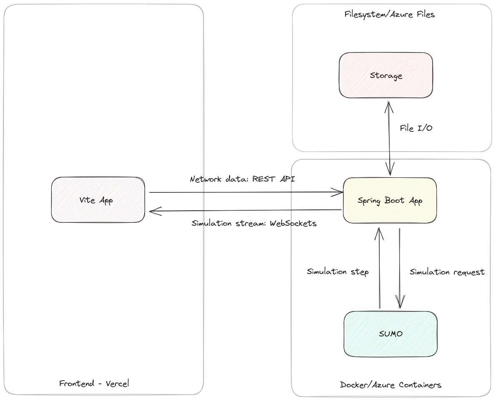
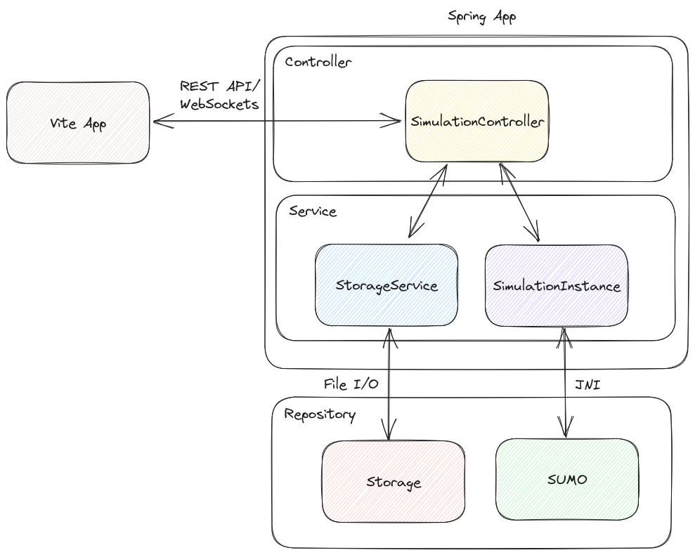

# Architecture

`urbanflo-sumo-server` acts as the backend to UrbanFlo, and is responsible for communicating with [SUMO](https://sumo.dlr.de) which is the simulation engine we use, as well as storing simulation files. 

The server itself mostly adopts a controller-server-repository architecture. The controller is responsible for defining API endpoints for the frontend, which it communicates using WebSocket for the simulation stream, and REST for pretty much anything else (e.g. uploading a document). The storage service serves as an intermediate between the controller and the filesystem, while `SimulationInstance` is responsible for interacting with SUMO via the [TraCI library](https://sumo.dlr.de/docs/Libtraci.html).

## Code map

### Package `config`

This package contains classes for Spring configuration, such as `WebSocketConfig` for WebSocket configuration.

### Package `controller`

Contains all controller classes.

### Package `jackson`

Contains custom Jackson serializers and deserializers, such as `UnixDoubleTimestampDeserializer` which deserializes Unix timestamps encoded as `Double` to Java `OffsetDateTime`.

### Package `model`

Contains model classes for various things, including API bodies and responses as well as SUMO data.

### Package `netconvert`

Contains any code related to [`netconvert`](https://sumo.dlr.de/docs/netconvert.html) which is a commandline SUMO utility for converting network data.

### Package `simulation`

Any code for running and managing simulations, such as `SimulationInstance` which contains a running simulation instances

### Package `storage`

Anything related to storage, such as `FilesystemStorageService` which is our current implementation of the storage service
